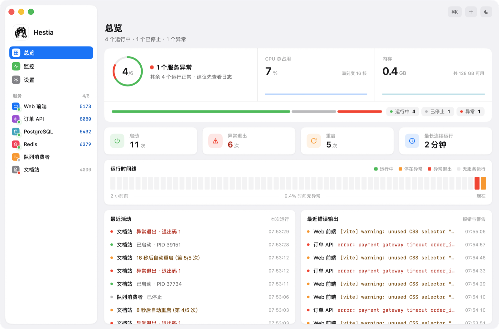
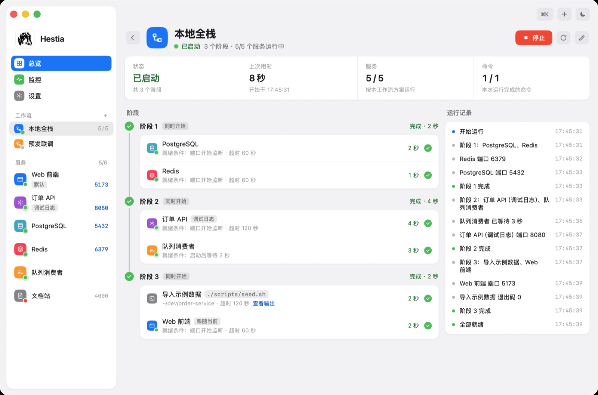
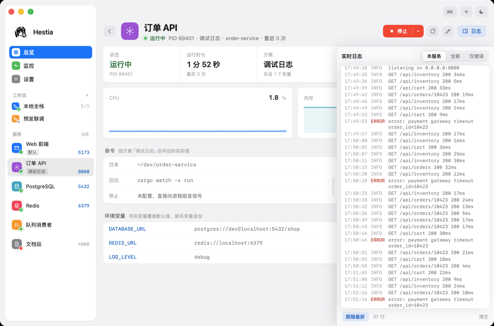
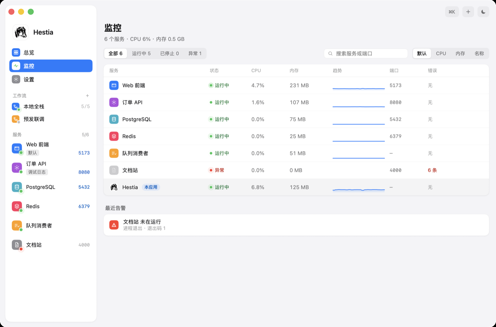
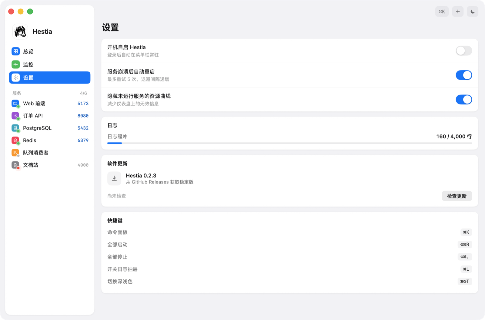

# Hestia

本地开发服务的启动管理器，macOS 桌面应用。

一个项目跑起来常常要开好几个终端标签：前端、后端、数据库、队列消费者，各占一个窗口，
关机前还得挨个 `Ctrl-C`。Hestia 把这些命令收在一处——一次点击全部拉起，一处看日志，
一处看资源占用，退出时连子进程一起收干净。



## 功能

### 总览

服务健康度与 CPU、内存总占用，本次运行以来的启动、异常退出与重启次数。运行时间线把所有服务
合成一条，最近 2 小时每 2 分钟一格，按这段时间里最严重的情况着色，悬停可看该时段的状态。
下方是服务与工作流的启停记录，以及服务输出里的报错、警告，两列各保留最近 50 条，点一条进入对应的服务或工作流。

### 进程托管

用登录 shell 执行你配置的启动命令，`setsid` 建立独立会话，因此停止时能把整棵进程树
连同孙子进程一起收掉，不会留下占着端口的残留。

- 配了停止命令就先执行它并等 8 秒；没配或没生效则向进程组发 `SIGTERM`，再等 5 秒仍在就 `SIGKILL`
- 非手动退出记为异常；开启自动重启后按 1、2、4、8、16 秒退避重试，最多 5 次
- 工作目录支持 `~`，环境变量逐条注入

### 启动方案

同一个目录常有几种启动方式：连不同的环境、换一套构建工具。服务可以带多个方案，
服务自身的命令与环境变量是默认方案，其它方案只写与默认方案不同的部分：

- 命令留空沿用默认方案；环境变量同名的覆盖，新名的追加
- 详情页的启动按钮带下拉菜单，选中哪个方案就以它启动，并记为当前方案
- 运行中选择另一个方案会先停掉当前进程，再按新方案启动；重启与崩溃后的自动重启沿用进程启动时的方案
- 详情页列出合并后的实际命令与环境变量，并标明每一项来自默认方案还是当前方案

### 工作流

一次拉起一组服务，并且按顺序等它们就绪。工作流由若干阶段组成，阶段依次执行，
同一阶段内的步骤同时开始，全部完成后才进入下一阶段。步骤有两种：

- 服务步骤：以指定方案启动服务（也可跟随服务的当前方案），不改动服务的当前方案。就绪条件是「进程树开始监听端口」或「启动后等待若干秒」。
  服务已按该方案运行时直接判断就绪，不会重启
- 命令步骤：执行一次性命令，例如 `pnpm i`，退出码为 0 视为完成，超时后整组进程被回收

某一步失败时不再执行后续阶段，已经启动的服务保持运行（包括等端口超时的服务），工作流页会标出失败原因并提供重新运行。
停止工作流时取消未完成的步骤，按阶段倒序停掉按该工作流方案运行的服务，并把其中异常退出的服务清回已停止。
其它已启动且未停止（进行中、已完成或失败）的工作流正在使用的服务不会被停掉，运行记录里会注明；
没有启动过的工作流即使所含服务都在运行，也不算在使用。

运行页的服务步骤按服务此刻的进程显示，阶段与工作流的状态再由步骤推出：

- 服务正按这一步的方案运行即为完成，不论由哪个工作流或手动拉起；只有本次运行完成的步骤标注耗时
- 执行过的步骤，服务后来异常退出显示失败，被停掉或换了方案显示已停止；工作流停止后，执行过的命令步骤也显示已停止
- 等待就绪中的步骤，以及工作流未被停止时的失败，按运行记录显示
- 步骤图标右下角的圆点是服务此刻的状态；服务在运行但用的不是这一步要求的方案时画成空心绿圈

工作流自身的状态区分是否启动过：启动过且未停止的显示「已启动」或「部分运行」，状态点带呼吸光晕；
没有启动、所含服务恰好由别处拉起的显示「已就绪」或「部分就绪」，状态点不带光晕；服务只有部分在运行时状态点为空心。
启停按钮只看工作流是否已启动：进行中、已启动、部分运行时是停止，失败后是重新运行，其余是启动。



### 端口自动推断

不少工具在配置端口被占用时会自动改用别的端口，只看配置值会对不上。Hestia 按进程树的
pid 查实际监听的端口，界面上一律显示探测到的真实值，与配置不一致时在详情页注明配置值。
侧栏里运行中服务的端口可以直接点开，在浏览器里访问对应的 `localhost` 地址。

### 强制退出后的清理

正常退出时向所有被托管的进程组发信号。但那条路覆盖不了 `SIGKILL`，因此另做两层兜底：

- 为 `SIGTERM` / `SIGINT` / `SIGHUP` 装处理函数就地回收
- 运行中的进程组落盘，下次启动先用 `ps` 比对命令行确认还是同一个进程（pid 可能已被复用），再整组回收

### 实时日志



`stdout` 与 `stderr` 分别按行读取，按行内容判定级别，内存环形缓冲默认保留 4,000 行（设置里可在 1,000–20,000 行之间调整，也可一键清除），
每 200ms 成批推给界面，话痨的构建工具也不会刷爆界面。日志在详情页右侧的抽屉里查看（`⌘L` 开关），
可按本服务 / 全部 / 仅错误过滤。

### 监控面板



每 1.4 秒采样一次，按父子关系累加整棵进程树的 CPU 与常驻内存。Hestia 自身的占用固定列在表格末尾，
带「本应用」标签，便于和被托管的服务对比。
支持按状态筛选、按服务名或端口搜索、按 CPU / 内存 / 名称排序。服务与状态两列固定，
窗口较窄时其余列横向滚动。

CPU 用的是「占单核的百分比」，与 `top`、活动监视器同一口径，所以多进程服务超过 100%
是正常的；总览上的 CPU 总占用按本机核数折算满刻度。

### 菜单栏常驻

托盘图标按运行状态切换：有服务在跑时播放尾焰动画，全部停止时是熄火的火箭。
点击图标在正下方展开面板，可以直接启停服务与工作流，也可以一键全部启动 / 全部停止；点面板标题、某个服务或工作流会打开主窗口
并收起面板。右键菜单可打开主窗口或退出。
关闭主窗口只是收进菜单栏，进程继续托管。

### 其它



- 侧栏的服务列表按服务类型显示彩色图标，工作流图标的颜色可在编辑时选择，图标右下角的圆点表示运行状态；工作流行尾显示运行中的服务数；带方案的服务在名称下方显示当前方案标签，运行中服务的端口显示在行尾；列表支持拖拽排序
- `⌘K` 命令面板，可搜索并启停任意服务
- 深浅两套配色
- 新建服务时可用系统对话框选择工作目录
- 可设置登录后自动常驻菜单栏
- 「设置 — 软件更新」从 GitHub Releases 下载新版，替换当前应用后重启，下载的安装包随即删除；「每天自动检查」默认开启，启动时及之后每 24 小时检查一次，发现新版本时侧栏「设置」行尾显示「新版本」
- 「设置 — 配置」把服务、工作流与偏好设置导出为一个 JSON 文件；导入时可选合并（同一 id 以文件为准，其余保留）或替换（以文件为准，不在文件里的服务先停止再删除，开机自启保留本机设置）

## 安装

从 [Releases](https://github.com/UreMySunshine/hestia/releases) 下载 DMG，拖进「应用程序」。

应用未做公证签名，首次打开会被 Gatekeeper 拦下。在「系统设置 — 隐私与安全性」里点「仍要打开」即可。

配置保存在 `~/Library/Application Support/com.kira.hestia/config.json`，
首次运行是空的，点总览上的卡片添加第一条启动命令。之后的版本可以在「设置 — 软件更新」里直接安装。

## 从源码运行

需要 Xcode（或 Command Line Tools）与 [Rust](https://rustup.rs)。构建脚本直接调用 `swiftc` 与 `cargo`，不需要 Xcode 工程。

```bash
SDKROOT="$(xcrun --sdk macosx --show-sdk-path)" mac/build.sh --dev
open "mac/build/Hestia Dev.app"
```

`--dev` 换用独立的包标识，可与已安装的正式版同时运行。`--dmg` 另外打出 DMG 安装包：

```bash
SDKROOT="$(xcrun --sdk macosx --show-sdk-path)" mac/build.sh --dmg
```

测试（进程托管的集成测试会真的拉起进程再回收）：

```bash
cargo test --manifest-path core/Cargo.toml
```

## 发版

推送到 `main` 时，流水线读取 `core/Cargo.toml` 的版本号；若对应的 `v<版本>` 标签尚不存在，
构建通过后自动打标签并发布 Release，附带 Apple Silicon 版的 DMG。版本号没变就只构建不发版。

因此发版就是改 `core/Cargo.toml` 的 `version` 后提交推送。应用内的检查更新读取的就是这里的 Release。

## 技术栈

界面是 SwiftUI，进程托管核心是 Rust，编译成动态库经 C 接口供界面调用。

```
core/src/
  manager.rs         进程托管、资源采样、日志缓冲
  manager/flow.rs    工作流的阶段执行、停止与状态推导
  lib.rs             供界面调用的 C 接口
  reaper.rs          信号处理，强制退出时就地回收
  shellenv.rs        从登录 shell 取回 PATH
mac/Sources/
  Screens/           总览、服务详情、服务表单、工作流运行页与表单、监控、设置、命令面板
  MenuBar/           菜单栏图标与面板
  Core/              界面状态、与核心的桥接、开机自启、软件更新
  Design/            配色、图标与基础组件
mac/Resources/       应用图标、菜单栏图标及其原稿，make_tray.py 从原稿裁出菜单栏动画帧
mac/build.sh         构建与打包
```

## 已知限制

- 只支持 Apple Silicon 芯片与 macOS 14 及以上
